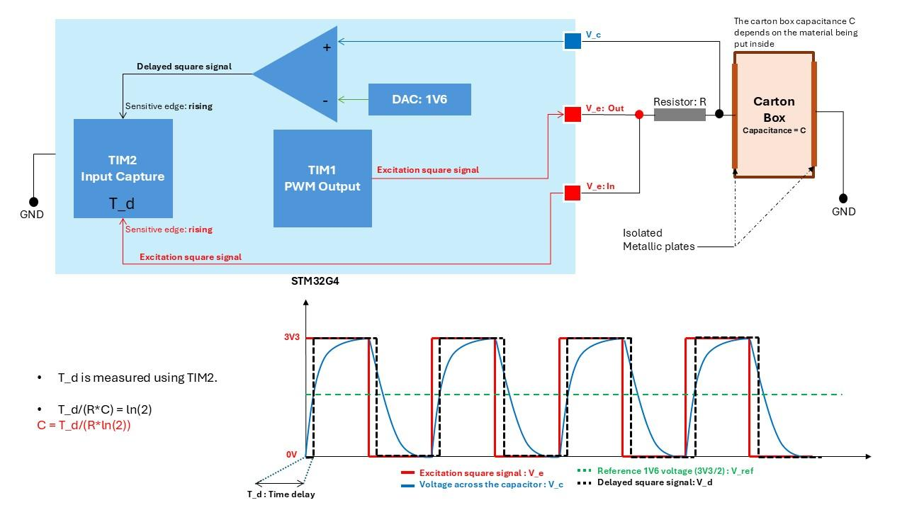

# Capacitance Measurement System on STM32G474RE

An embedded RC timing system for estimating an unknown capacitance with the analog peripherals and timers of an STM32G474RE. The system applies a repeatable excitation waveform to a resistor-capacitor network, detects when the capacitor reaches a programmable voltage threshold, and converts that delay into capacitance.

The project is intended for an STM32G474RE board with an external capacitor, sensor, or pair of isolated metallic plates acting as the unknown capacitance.

## Project status

This repository contains the STM32CubeIDE project, CubeMX configuration, application source, STM32G4 HAL/CMSIS drivers, linker scripts, and the system concept diagram. The firmware is a measurement core rather than a finished instrument: the calculated result is stored in the global `C_nF` variable and is currently intended to be inspected with a debugger or used as the basis for a future display, UART, USB, or logging interface.

## Measurement principle

The unknown capacitor `C` is charged through a known resistor `R` by the high level of a square wave. The capacitor voltage follows:

```text
Vc(t) = VDD * (1 - exp(-t / (R * C)))
```

An STM32 comparator changes state when `Vc` reaches the DAC-generated threshold `Vth`. The elapsed time from the excitation edge to the comparator edge is `Td`:

```text
Vth = VDD * (1 - exp(-Td / (R * C)))
Td  = -R * C * ln(1 - Vth / VDD)
```

Therefore, the general capacitance calculation is:

```text
C = Td / (-R * ln(1 - Vth / VDD))
```

For the special case `Vth = VDD / 2`:

```text
Td = R * C * ln(2)
C  = Td / (R * ln(2))
```

The current application uses the half-scale equation in `main.c`. If the threshold is changed significantly, the calculation must be updated to use the general equation.

## Signal flow

1. TIM1 Channel 1 generates the excitation PWM.
2. The PWM drives the known resistor and unknown capacitor network.
3. The capacitor voltage is connected to the positive input of COMP1.
4. DAC1 Channel 1 supplies the negative comparator input.
5. COMP1 produces a digital transition when the capacitor reaches the threshold.
6. TIM2 resets its counter on the configured trigger and captures the comparator timing edge.
7. The capture count is converted to seconds using the TIM2 clock frequency.
8. The firmware converts the delay to nanofarads and stores it in `C_nF`.

The included `concept.jpg` shows the RC sensor, resistor, isolated plates, comparator, DAC reference, PWM excitation, delayed comparator signal, and timing relationship.



*Figure 1. RC capacitance measurement architecture and timing signals.*

## Implemented firmware configuration

The current values are defined in `Core/Src/main.c` and should be treated as starting points for the target board and circuit:

| Item | Current value | Purpose |
| --- | ---: | --- |
| MCU | STM32G474RE | Target microcontroller |
| Reference resistor | 470 ohm | `R_VALUE` in the capacitance equation |
| TIM2 clock | 170 MHz | `TIM2_CLK_HZ` used to convert counts to seconds |
| DAC code | 1985 | DAC1 Channel 1 comparator threshold |
| TIM1 prescaler | 849 | PWM timer prescaler |
| TIM1 period | 999 | PWM auto-reload value |
| TIM1 pulse | 499 | Approximately 50 percent duty cycle |
| TIM2 prescaler | 0 | One counter tick per TIM2 clock cycle |
| TIM2 counter limit | 0xFFFFFFFF | 32-bit timing range |

With a 3.3 V DAC reference, code 1985 corresponds to approximately 1.60 V, before considering DAC and analog tolerances. It is not exactly half-scale. Measure or calculate the actual threshold and use the general equation when accuracy matters.

## Hardware requirements

- STM32G474RE development board or custom board
- Known resistor with a suitable value and tolerance
- Unknown capacitor, sensor, or isolated conductive plates
- Stable 3.3 V supply and a shared signal ground
- Wiring that connects the PWM output, capacitor node, comparator input, DAC threshold, and comparator output to the pins defined by the `.ioc` file
- Optional oscilloscope for checking the excitation, capacitor voltage, DAC reference, and comparator output

The resistor and capacitor must be selected so that the threshold crossing occurs within one PWM high period and within the TIM2 measurement range. Keep wiring short and minimize parasitic capacitance around the sensing node.

## Firmware behavior

During startup, the application initializes GPIO, COMP1, DAC1, TIM1, and TIM2. It then:

- Loads DAC1 Channel 1 with code `1985` and starts the DAC.
- Starts COMP1.
- Starts TIM1 Channel 1 PWM output.
- Starts TIM2 Channel 1 input capture with interrupts.

When TIM2 reports a capture on Channel 1, the callback stores the captured count in `t_delay` and sets `new_measurement`. The main loop then performs:

```c
Td = t_delay / TIM2_CLK_HZ;
C  = Td / (R_VALUE * LN2);
C_nF = C * 1e9f;
```

The current code does not average samples, reject invalid captures, compensate for comparator delay, or transmit the result. Those are appropriate next steps for a production measurement instrument.

## Repository layout

```text
Core/
  Inc/              Application and STM32 headers
  Src/              main.c, interrupts, HAL MSP, system startup support
  Startup/          Cortex-M4 startup assembly
Drivers/            STM32G4 HAL and CMSIS source and headers
.ioc                STM32CubeMX peripheral configuration
.cproject           STM32CubeIDE C/C++ project configuration
.project            Eclipse/STM32CubeIDE project metadata
.settings/          STM32CubeIDE settings
*.ld                Flash and RAM linker scripts
concept.jpg         Measurement architecture and timing diagram
README.md           Project documentation
```

Generated `Debug/` and `Release/` output is excluded by `.gitignore` and should be recreated by the local build environment.

## Build and flash with STM32CubeIDE

1. Install STM32CubeIDE with STM32G4 device support.
2. Clone or open this repository in a location suitable for CubeIDE projects.
3. In STM32CubeIDE, import the directory as an existing project.
4. Verify that the selected device matches STM32G474RE and that the debug probe is configured.
5. Build the project using the Debug configuration.
6. Connect the RC circuit and verify the pin assignments in `capacitance_measurement.ioc`.
7. Flash the firmware to the board.
8. Run under the debugger and inspect `C_nF`, `t_delay`, and `new_measurement`.

Do not edit generated peripheral sections in `main.c` unless the corresponding CubeMX configuration is also updated. User changes should remain inside the `USER CODE BEGIN` and `USER CODE END` regions so they survive code regeneration.

## Calibration procedure

1. Measure the actual resistor value with a calibrated multimeter and update `R_VALUE`.
2. Measure the actual DAC threshold voltage at the comparator input, or calculate it from the measured DAC reference and code.
3. Confirm the effective TIM2 clock from the clock tree and update `TIM2_CLK_HZ` if necessary.
4. Connect a reference capacitor with a known value.
5. Observe the PWM, capacitor voltage, and comparator output on an oscilloscope.
6. Confirm that the comparator transition occurs during the intended charging interval.
7. Compare `C_nF` against the reference capacitor and record any fixed offset or scale error.
8. Repeat the measurement with several known capacitors across the intended range.

The measurement error is affected by resistor tolerance, clock accuracy, DAC reference accuracy, DAC output impedance, comparator propagation delay, input filtering, PCB and wiring parasitics, capacitor leakage, and the sensor's dependence on surrounding materials.

## Troubleshooting

### `C_nF` does not update

Check that the comparator output is reaching the TIM2 input, that the capacitor crosses the DAC threshold, and that the capture interrupt is enabled. Inspect `new_measurement` and `t_delay` in the debugger.

### The value is zero or unstable

Check the resistor and capacitor wiring, ground reference, PWM amplitude, threshold voltage, and capture edge polarity. Use an oscilloscope to verify that the comparator produces one clean transition per measurement cycle.

### The value is consistently scaled incorrectly

Check `R_VALUE`, `TIM2_CLK_HZ`, the actual DAC threshold, and the selected equation. The half-scale `ln(2)` equation is only valid when the threshold is truly half of the charging supply.

### The capture overflows or misses the edge

Increase the PWM high-time, reduce the RC time constant, choose a suitable resistor, or add input conditioning. The threshold crossing must occur before the next relevant timing event and within the 32-bit TIM2 count range.

## Development notes

- The STM32CubeMX source of truth is `capacitance_measurement.ioc`.
- HAL and CMSIS drivers are included so the project can be imported without reconstructing the dependency tree.
- Build products are intentionally not committed.
- The project has no host-side automated test suite because the measurement depends on STM32 peripherals and external analog hardware.

## License

No separate project license has been added. Add an appropriate license before distributing or publishing the repository.
